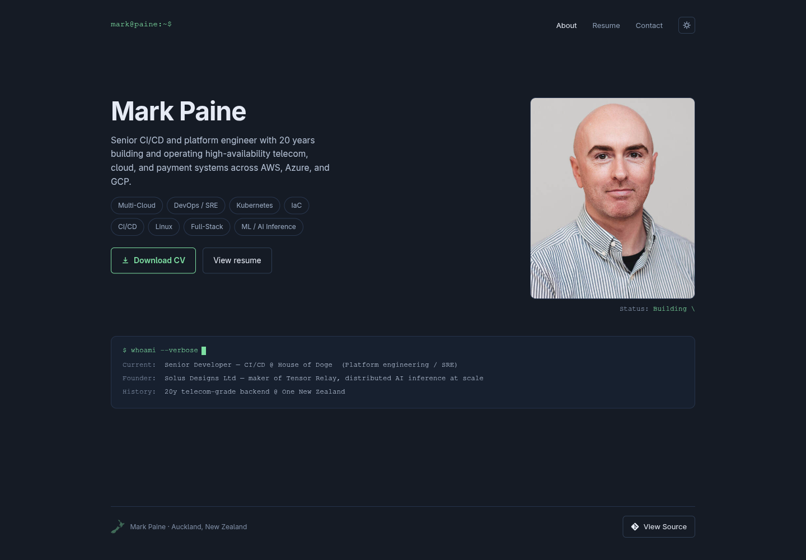

# CV Site

[](https://github.com/mpainenz/markpaine-site/actions/workflows/deploy.yml)
[](https://nextjs.org/)
[](LICENSE)

A fork-friendly personal site and printable CV built with Next.js, Playwright,
and Docker.

[View the live example](https://markpaine.dev) ·
[Download the generated CV](https://markpaine.dev/Mark-Paine-CV.pdf)



The resume page is the source for both the website and the PDF. Playwright
prints `/resume/` with the production print stylesheet, keeping the two formats
in sync.

## Features

- Static Next.js export that can be hosted almost anywhere.
- Central identity and presentation configuration in `data/site.mjs`.
- Separate career content in `data/cv.ts`.
- Responsive dark and light themes with accessible navigation.
- Search metadata, JSON-LD, sitemap, robots policy, and custom 404.
- A4 PDF generation with content and reading-order validation.
- Automated lint, type, configuration, responsive, link, and accessibility checks.
- Clean-checkout, unprivileged nginx container build with security headers.
- Optional GHCR publishing and GitOps deployment for repository owners who enable it.

## Make it yours in five minutes

1. Use **Fork** or **Use this template** on GitHub, then clone your copy.
2. Run `npm install`.
3. Replace the values in `data/site.mjs`. A neutral starting point is available
   in `examples/site.mjs`.
4. Replace the experience, skills, and education in `data/cv.ts`; see
   `examples/cv.ts` for the expected shape.
5. Replace `public/headshot.jpg` with an image you own.
6. Change `pdfPath` in `data/site.mjs` and set the matching filename when
   rendering, for example:

   ```bash
   CV_PDF_FILENAME=Alex-Example-CV.pdf npm run pdf
   ```

7. Run the complete verification suite:

   ```bash
   npm run verify
   ```

The default New Zealand footer outline is optional. Set `footerDecoration` to
`none` for a text-only footer, and update `location` plus `mobileLocation`.

## Local development

Requires Node.js 20.9 or newer.

```bash
npm install
npx playwright install chromium
npm run dev
```

Useful commands:

```bash
npm run lint       # ESLint
npm run typecheck  # TypeScript without emitting files
npm test           # configuration tests
npm run build      # static export to out/
npm run pdf        # render the CV PDF from the built resume
npm run pdf:check  # validate PDF structure, content, and section order
npm run test:site  # responsive, link, route, and accessibility checks
npm run verify     # run the full local/CI quality gate
```

`npm run pdf` and `npm run test:site` require the Chromium browser installed by
Playwright and a completed production build.

## How it works

```text
data/site.mjs + data/cv.ts
             |
             v
       Next.js pages
          /  /resume/  /contact/
             |
             +--> static export in out/
             |
             +--> Playwright print --> CV PDF in out/
```

The application uses the Next.js App Router but exports plain static files.
The PDF renderer starts a loopback-only static server, verifies identifying
resume content, prints the page, and checks the resulting artifact. The smoke
test uses the same server to exercise the built output at desktop and mobile
sizes.

Key paths:

- `data/site.mjs` — identity, URLs, homepage copy, assets, and display options.
- `data/cv.ts` — experience, skills, education, and earlier roles.
- `app/` — pages, metadata routes, global styles, and print layout.
- `components/` — navigation, footer, theme, and clipboard interaction.
- `scripts/` — static server, PDF generation/validation, and browser checks.
- `.github/workflows/deploy.yml` — read-only validation plus opt-in publishing.

## Deployment

### Static hosting

Run `npm run build`, then `npm run pdf`, and publish the contents of `out/`.
Any provider that serves static files can host the result.

### Docker

The multi-stage image builds the site and PDF from source, then serves them
from an unprivileged nginx process:

```bash
docker build -t cv-site .
docker run --rm -p 8080:8080 cv-site
```

Open <http://localhost:8080>.

### GitHub Actions, GHCR, and optional GitOps

Validation runs for every pull request and push to `main` with read-only
repository permissions. Publishing is off by default so forks do not
accidentally push images or call private deployment systems.

To publish an image to your repository's GHCR namespace, create the repository
variable `ENABLE_IMAGE_PUBLISH=true`.

To also update a Kustomize image tag, configure:

- Variable `ENABLE_GITOPS_DEPLOY=true`
- Variable `GITOPS_REPOSITORY`, such as `owner/infrastructure`
- Variable `GITOPS_PATH`, the directory containing `kustomization.yaml`
- Secret `GITOPS_TOKEN`, scoped only to the required repository

## Assets and attribution

The source code is MIT licensed. The example portrait at
`public/headshot.jpg` is Mark Paine's personal photograph, is not licensed
under MIT, and must be replaced in forks. See [ASSETS.md](ASSETS.md).

The About/Resume/Contact structure and printable-resume approach were inspired
by Michael D'Angelo's [personal site](https://mldangelo.com/) and
[open-source repository](https://github.com/mldangelo/personal-site). No code
was copied.

## License

[MIT](LICENSE) © Mark Paine. Please use it, fork it, change it, and make it
your own.
